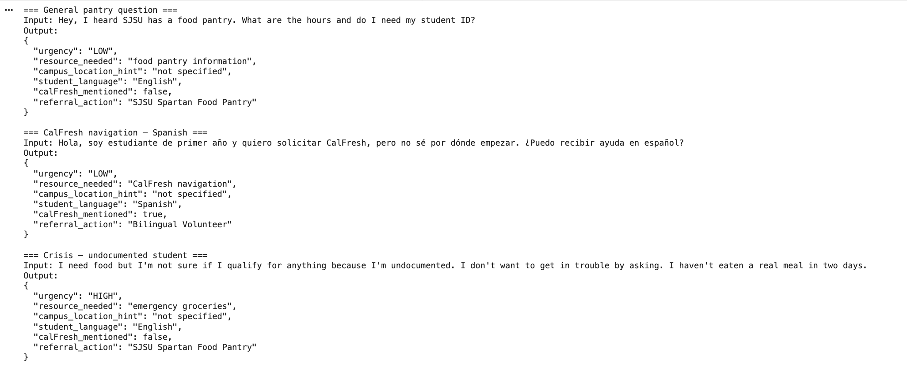
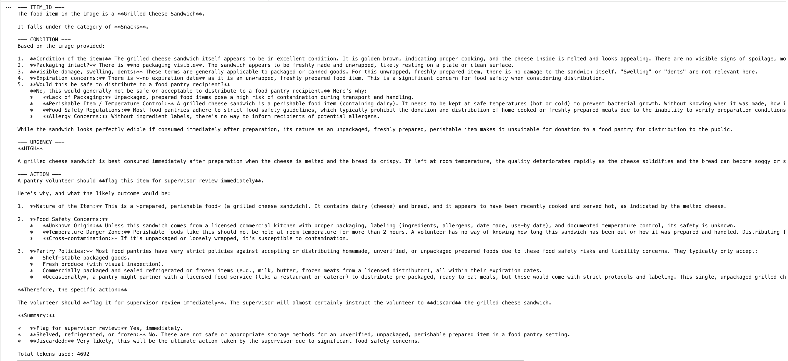
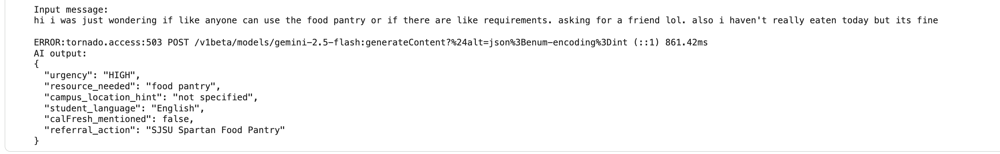

# AI for Social Good: SJSU Campus Food Insecurity Intake System

**Course:** Fundamentals of MIS — AI for Social Good, Spring 2026  
**SDGs:** SDG 2 (Zero Hunger) | SDG 10 (Reduced Inequalities)  
**Tools:** Google Gemini API (gemini-2.5-flash), Python, Google Colab

---

## Problem

Sofia is a first-generation SJSU sophomore who receives CalFresh benefits but runs out of food dollars by the 20th of each month. She is Spanish-dominant, did not know the SJSU Spartan Food Pantry existed until a classmate mentioned it, and is unsure whether her immigration status affects her eligibility. When she finally texted an intake line for help, she received no response for four hours. She did not text again.

The failure point is not that resources don't exist — SJSU has a food pantry, a Basic Needs Center, and nearby Second Harvest locations. The failure is that there is no reliable path to action: a student's message arrives as unstructured free text, a volunteer must manually read, interpret urgency, and route it, and during high-volume periods (end of month, finals week) the delay is long enough that a student in crisis stops trying.

---

## AI Capability

We used **structured data extraction** (Lab 2) as the primary capability. When a student sends a message in any language, the AI extracts six fields — urgency, resource needed, location hint, student language, CalFresh mention, and referral action — into a consistent JSON record every time. This directly addresses the failure point: the problem isn't that information doesn't exist, it's that it arrives in a format no system can reliably act on at volume. The Lab 2 schema solves that structurally.

We also adapted **image recognition** (Lab 3) to address a secondary bottleneck: pantry volunteers manually categorizing every donated item. The AI analyzes a photo of a donated food item and returns a structured assessment — item name, category, condition, storage urgency, and volunteer action — without any manual data entry.

---

## Workflow

**Student intake (Lab 2):**

```
Student message (any language, SMS or web form)
        ↓
Gemini extracts 6 fields into JSON:
urgency | resource_needed | campus_location_hint
student_language | calFresh_mentioned | referral_action
        ↓
HIGH urgency → flagged for human volunteer review before any response
LOW / MEDIUM → automated reply sent in student's detected language
        ↓
All records logged for staff review each shift
```



Tested on three contrasting messages: a general pantry question (LOW urgency, English), a CalFresh navigation request in Spanish (LOW urgency, Spanish → Basic Needs Center), and an undocumented student in crisis (HIGH urgency → Basic Needs Center). Language detection and urgency routing worked correctly across all three.

**Donation intake (Lab 3):**

```
Volunteer photographs a donated food item
        ↓
Gemini identifies item, assesses condition, assigns storage urgency,
and recommends a volunteer action
        ↓
Volunteer confirms or overrides — item logged to inventory
Items flagged as damaged or unsafe → supervisor queue
```



Tested on a grilled cheese sandwich photo. The AI correctly identified the item, assessed condition, and produced a structured recommendation. In a real pantry setting this workflow applies to canned goods, dry goods, and packaged donations where visual condition is the primary intake signal.

The AI produces structured input for human decision-making in both workflows. It does not respond to students or log items autonomously.

---

## Failure Case

**Input:** "hi i was just wondering if like anyone can use the food pantry or if there are like requirements. asking for a friend lol. also i haven't really eaten today but its fine"

**AI output:** `urgency: HIGH`, `referral_action: SJSU Spartan Food Pantry` — no human review flag triggered.



**Assessment: Near-miss.** The AI correctly detected HIGH urgency despite the hedging language ("asking for a friend," "its fine") — picking up on "I haven't really eaten today." But the system has no mechanism to treat a HIGH urgency record differently from a LOW one in terms of who responds and how. An automated reply with pantry hours would go out regardless. A student who wrote this way needed a human to reach out directly — not a text with operating hours. The lab output showed us that urgency detection alone is not sufficient: what matters is what the system does with that urgency signal.

---

## Oversight and Tradeoff

**Oversight position:** Any record where urgency is HIGH must be held for human volunteer review before any automated response is sent. This is a hard rule, not a probability threshold. The edge case output showed us that a correctly classified HIGH urgency message can still produce an inadequate automated response — the classification is necessary but not sufficient for the right action.

**The one change:** Add a `requires_human_review` flag to the schema, set to `true` whenever urgency is HIGH or the message contains fear or status language. A volunteer reviews all flagged records before any outreach goes out.

**What it costs:** This reduces automation coverage by an estimated 15–25% of intake volume. HIGH urgency cases arrive most frequently at end of month and finals week — exactly when volunteer bandwidth is also lowest. Flagged records may sit in queue for 30–60 minutes during peak periods. The tradeoff is explicit: faster automated response for routine cases, mandatory human judgment for the cases where the wrong response causes the student to disappear from the system entirely.

---

*AI assistance used: Gemini API for all model calls. Code structure adapted from Lab 2 and Lab 3 originals. Schema fields, test cases, edge case design, and system decisions made by the team.*
